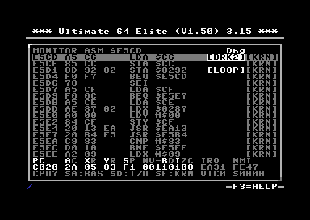

Machine Code Monitor
====================

The Machine Code Monitor is a keyboard-driven tool for inspecting and editing live or frozen C64 memory.

It supports hexadecimal, ASCII, screen-code, binary, and assembly views, plus inline editing, bulk memory operations, file load/save, execution from a selected address, and a debugger that steps the C64's own 6510 and stops it at breakpoints.

Almost every command is a single keypress, and the monitor stays open until you exit it, so you can move freely between views and operations. If you forget a key, press ``F3`` for the on-screen help.

*Applies to: Ultimate-II+, Ultimate-II+L, Ultimate 64, Ultimate 64 II. The original Ultimate 1541-II does not carry the monitor.*

Entry and Exit
--------------

``C=`` denotes the Commodore key. For example, ``C=+O`` means: hold the Commodore key, then press ``O``.

To open the monitor, use one of the following:

-  Press ``C=+O``.
-  Press ``F5``, open ``Developer``, then select ``Machine Code Monitor``.

Open the built-in help with ``F3`` or ``?``. It lists every key binding, in three blocks: the views and what
modifies them, the commands that act on memory, and the keys that need ``C=`` or a named key. ``F1``/``SH+SPACE``
and ``F7``/``SPACE`` page it.

.. image:: ../media/monitor/help_view.png
   :alt: Monitor built-in help screen listing key bindings

To close the monitor:

-  Press ``C=+O`` again.
-  Press ``RUN/STOP``, ``ESC``, or the C64's top-left ``←`` key when no edit operation or popup is active.

``RUN/STOP``, ``ESC`` and ``←`` are one Back action. Each press closes one active layer, such as the help, a number
expression, a popup, a command prompt or edit mode, and closes the monitor only once nothing is left. Where ``←`` is
data, in ASCII and Screen editing and in the ASCII and Screen rows of the Number popup, use ``RUN/STOP`` or ``ESC``
instead.

Two shortcuts act on the machine rather than on the view, and both work from a memory view and from edit mode:

+----------+---------------------------------------------------------------------------------------------------+
| Key      | Action                                                                                            |
+==========+===================================================================================================+
| ``C=+R`` | Reset the C64. This is the same action as the task menu's ``Reset C64``, so the on-device menu    |
|          | closes with the machine's screen where the interface is drawn there.                              |
+----------+---------------------------------------------------------------------------------------------------+
| ``C=+I`` | Swap the interface between the freeze menu and the HDMI overlay, and close the menu. The setting  |
|          | takes effect the next time the menu opens.                                                        |
+----------+---------------------------------------------------------------------------------------------------+

Neither has a confirmation. A backend that cannot reach a reset reports ``RESET UNAVAILABLE`` and leaves the machine,
the view and edit mode unchanged.

Screen Layout
-------------

The monitor screen has three fixed regions:

Header
~~~~~~

-  Shows the current view, cursor address, and active modes.
-  Mode indicators may include ``Undoc``, ``Range``, ``Frz``, ``Poll``, ``Dbg``, or ``EDIT``.
-  Each indicator has a fixed slot, counted back from the right edge. ``Undoc`` and ``Range`` share one slot, and
   ``Poll`` and ``Dbg`` share another, so only one of each pair appears at a time.

Body
~~~~

-  Shows the memory region around the current cursor address.
-  The active cursor position is highlighted in reverse.
-  May show popups, such as search results, load/save prompts, completion pickers, or bookmarks.

Footer
~~~~~~

-  Shows the active CPU port mapping and VIC bank. For more details, see :ref:`machine-monitor-cpu-vic-bank-display`.
-  ``CPU0``..\ ``CPU7`` identify the selected CPU memory configuration.
-  ``VIC0``..\ ``VIC3`` identify the selected VIC bank and its base address.
-  When jumping to a bookmark, the footer briefly shows bookmark information.

Example layout, with the ``Undoc``, ``Poll``, and ``EDIT`` mode indicators active in the header:

.. image:: ../media/monitor/layout_example.png
   :alt: Monitor screen layout showing the header, body, and footer regions

Views
-----

The monitor provides five primary views:

===== ======== === ===============================
Key   View     ID  Purpose
===== ======== === ===============================
``M`` Memory   HEX Hexadecimal byte view
``A`` Assembly ASM Disassembly and inline assembly
``B`` Binary   BIN Bit-level byte view
``I`` ASCII    ASC ASCII byte view
``V`` Screen   SCR Screen code view
===== ======== === ===============================

.. _memory--hex-view:

Memory / Hex View
~~~~~~~~~~~~~~~~~

Memory view shows raw bytes in hexadecimal together with a compact printable-character preview.

Example:

.. image:: ../media/monitor/hex_view.png
   :alt: Monitor Memory / Hex view at $0168

Assembly View
~~~~~~~~~~~~~

Assembly view shows decoded 6510 instructions, their instruction bytes, and the memory source used for each row.

The source tag occupies three characters inside the brackets, so the column stays aligned across bank boundaries: ``[RAM]``, ``[BAS]``, ``[CHR]``, ``[I/O]``, ``[KRN]``, and ``[CPU]`` for the memory currently visible to the CPU on an Ultimate-II+.

Example:

.. image:: ../media/monitor/assembly_view.png
   :alt: Monitor Assembly view at $E011

Assembly view is also a full inline assembler: in edit mode it offers opcode completion as you type. See :ref:`machine-monitor-inline-assembler`.

Data Regions
^^^^^^^^^^^^

``$D000-$DFFF`` is shown as ``DATA`` rows of two bytes each when either I/O or Character ROM is banked in. I/O reads
live registers, so decoding it would change the instruction length, and with it the address of every row below, on
each redraw. Character ROM is stable, but it holds character bitmaps that never were code. With RAM banked in, the
same addresses are disassembled normally: the rule follows the banked source, not the address range. On an
Ultimate-II+, ``$D000-$DFFF`` is always disassembled, because that backend reports one source for the whole CPU view.

.. image:: ../media/monitor/asm_data_rows.png
   :alt: Monitor Assembly view showing $D000 as DATA rows of two bytes

The rows are grouped from the start of the region, so where a ``DATA`` row begins does not depend on how the view
arrived there. ``$D000-$DFFF`` is 4096 bytes and divides into 2048 rows of two; a region whose length is odd ends
with a row of one byte.

A ``DATA`` row is edited in Assembly view like any other row. ``E`` enters edit mode and the cursor sits on the first
byte. Each displayed byte is its own edit position, two hex digits complete one, and ``LEFT``/``RIGHT`` step from
byte to byte and on into the row above or below. There is no opcode picker on a ``DATA`` row, because there is no
mnemonic to pick, and a letter key does nothing there. ``[I/O]`` is writable; ``[CHR]`` is ROM and refuses the write
as it does everywhere else. Editing the same bytes in Memory view with ``M`` works as before.

``DEL`` clears a ``DATA`` row's bytes to ``$00``. On a decoded instruction it still writes ``NOP``, which is what
keeps the code around it runnable; ``NOP`` means nothing in a region that is not code.

The two-byte row is how the bytes are shown, not what a range is made of. A range anchored with ``R`` on a ``DATA``
byte covers the bytes between its ends: anchoring on ``$D001``, moving right to ``$D002`` and pressing ``R`` copies
those two bytes and nothing else. A range that starts on a decoded instruction still takes that instruction whole, so
a range may cross between code and data without either end losing bytes.

Binary View
~~~~~~~~~~~

Binary view shows each byte as eight bits, using ``.`` for a cleared bit and ``*`` for a set bit. It is useful for inspecting registers, character glyphs, sprite data, and other bit-oriented memory.

Because C64 sprite data uses 3 bytes per row, binary view supports multiple ``W``\ idth modes for viewing bytes in different groupings.

The top status line shows the current byte address followed by the selected bit number, for example ``$DC00/7``. Bit 7 is the most significant bit on the left, and bit 0 is the least significant bit on the right.

Example:

.. image:: ../media/monitor/binary_view.png
   :alt: Monitor Binary view at $DC00

Cycling the ``W`` width mode to ``3S`` makes each row span the full 24 bits of a sprite line, so 21 consecutive rows display a whole C64 sprite as a bitmap. Here a sprite stored at ``$2400``:

.. image:: ../media/monitor/binary_sprite.png
   :alt: Binary view in 3S sprite mode showing a 24 by 21 sprite bitmap

ASCII View
~~~~~~~~~~

Use ASCII view when the bytes are intended to be printable ASCII rather than C64 screen codes.

Behavior:

-  Bytes ``$20-$7E`` are shown as their normal ASCII characters.
-  All other bytes are shown as ``.``.
-  Typing a printable ASCII character writes that character's byte value.
-  Lowercase ASCII is preserved.

Example:

.. image:: ../media/monitor/ascii_view.png
   :alt: Monitor ASCII view at $A000

Screen View
~~~~~~~~~~~

Use Screen view when the bytes represent C64 screen codes, for example when viewing screen RAM, which by default starts at ``$0400``.

Screen view is for screen-code bytes, not PETSCII text.

The header shows the active screen charset mode:

-  ``MONITOR SCR U/G $xxxx`` for **Uppercase/Graphics**
-  ``MONITOR SCR L/U $xxxx`` for **Lowercase/Uppercase**

The active mode is changed with ``U``; see :ref:`machine-monitor-view-modifiers`.

Screen ``U/G``
^^^^^^^^^^^^^^

-  Displays ``$00`` as ``@``.
-  Displays ``$01-$1A`` as ``A-Z``.
-  Typing ``A-Z`` or ``a-z`` writes ``$01-$1A``.

Screen ``L/U``
^^^^^^^^^^^^^^

-  Displays ``$01-$1A`` as ``a-z``.
-  Displays ``$41-$5A`` as ``A-Z``.
-  Typing ``a-z`` writes ``$01-$1A``.
-  Typing ``A-Z`` writes ``$41-$5A``.

Example:

.. image:: ../media/monitor/screen_view.png
   :alt: Monitor Screen view at $0400

Because the monitor is rendered with the firmware UI font rather than the live C64 character set, graphics bytes are shown with readable fallback glyphs instead of exact C64 glyph shapes.

.. _machine-monitor-view-modifiers:

View Modifiers
--------------

Some keys modify the current view instead of switching to another view.

``U``: View-Specific Toggle
~~~~~~~~~~~~~~~~~~~~~~~~~~~

``U`` is context-sensitive:

+-------------+----------------------------------------------------------------------+
| View        | ``U`` behavior                                                       |
+=============+======================================================================+
| Assembly    | Toggles undocumented opcodes                                         |
+-------------+----------------------------------------------------------------------+
| Screen      | Toggles the monitor-local screen charset between ``U/G`` and ``L/U`` |
+-------------+----------------------------------------------------------------------+
| Other views | Ignored                                                              |
+-------------+----------------------------------------------------------------------+

In Assembly view, enabling undocumented opcodes affects how bytes are decoded and how assembly completion behaves.

In Screen view, ``U`` changes only the monitor-local interpretation of screen codes. It does not change the live C64 character set.

``W``: Width Mode
~~~~~~~~~~~~~~~~~

``W`` is view-dependent:

======== ======================================
View     ``W`` behavior
======== ======================================
Memory   Cycles ``8 <-> 16`` bytes per row
Binary   Cycles ``1 -> 2 -> 3 -> 3S -> 4 -> 1``
ASCII    Fixed-width, 32 bytes per row
Screen   Fixed-width, 32 bytes per row
Assembly Variable-width, 1 to 3 bytes
======== ======================================

Binary width details:

-  ``1``, ``2``, and ``3`` show one, two, or three bytes as bit fields with a trailing hex preview.
-  ``3S`` shows three bytes as one continuous 24-bit sprite-style row, with a hex preview.
-  ``4`` shows four bytes as one continuous 32-bit row without a trailing hex preview.

Navigation and Context
----------------------

-  ``J``: jump to an address.
-  ``G``: exit the monitor and execute from an address.
-  ``F1`` or ``Shift+Space``: page up.
-  ``F7`` or ``Space``: page down.
-  ``Enter``: in Assembly view, follow the target of a jumpable instruction, or return to the most recent saved source location when the current instruction is not jumpable and the follow stack is non-empty.
-  ``O``: cycle CPU port banking, ``CPU0``..\ ``CPU7``.
-  ``Shift+O``: cycle the VIC bank override.
-  ``Z``: toggle freeze when the backend supports it.
-  ``P``: toggle poll mode in the local monitor. Poll mode is unavailable over telnet.

Addresses in command prompts are hexadecimal.

Follow/Return
~~~~~~~~~~~~~

Follow code flow in the Assembly view:

-  ``Enter`` follows the resolved target when the cursor is on a jumpable instruction such as ``JMP``, ``JSR``, ``BEQ``, ``BNE``, ``BCC``, ``BCS``, ``BMI``, ``BPL``, ``BVC``, or ``BVS``.
-  ``Enter`` returns to the most recent saved source location when the current Assembly instruction is not jumpable and the follow stack is non-empty.
-  The follow stack holds up to 10 return locations. When it is full, the oldest entry is discarded and the newest 10 are kept.
-  After each successful follow or return, the bottom row shows a compact zero-based follow-stack status for about 2 seconds, for example ``F1 JMP $E000`` and ``F0 RET $A000``.

.. _machine-monitor-cpu-vic-bank-display:

CPU and VIC Bank Display
~~~~~~~~~~~~~~~~~~~~~~~~

The footer summarizes the selected CPU-visible memory configuration and VIC bank, for example ``CPU7 $A:BAS $D:I/O $E:KRN VIC0 $0000``.

``CPU0``..\ ``CPU7`` are shorthand for the three 6510 port memory-configuration bits at ``$0001``: ``LORAM``, ``HIRAM``, and ``CHAREN``.

In the normal no-cartridge configuration, the footer fields have these possible values:

====== =============== =========================
Field  Address range   Values
====== =============== =========================
``$A`` ``$A000-$BFFF`` ``BAS``, ``RAM``
``$D`` ``$D000-$DFFF`` ``I/O``, ``CHR``, ``RAM``
``$E`` ``$E000-$FFFF`` ``KRN``, ``RAM``
====== =============== =========================

======= ===========================
Value   Meaning
======= ===========================
``BAS`` BASIC ROM
``I/O`` I/O registers and Color RAM
``CHR`` Character generator ROM
``KRN`` KERNAL ROM
``RAM`` RAM
======= ===========================

``VIC0``..\ ``VIC3`` show the selected VIC bank controlled through CIA 2 port A at ``$DD00``, with base address ``$0000``, ``$4000``, ``$8000``, or ``$C000``.

Cartridges can further affect the CPU-visible memory map through the expansion-port ``GAME`` and ``EXROM`` lines.

The monitor tracks two CPU banks: the one the running 6510 executes from, taken from ``$0001``, and the one selected
with ``O`` for the view. While they match, the footer shows a single ``CPUx``. While they differ it shows both, as
``CxOy``, where ``Cx`` is the executing bank and ``Oy`` is the view bank::

   CPU7 $A:BAS $D:I/O $E:KRN VIC0 $0000
   C7O5 $A:RAM $D:I/O $E:RAM VIC0 $0000

The two differ where the monitor does not own the machine, so the running program keeps its own banking while ``O``
moves the view. In UI Freeze mode the machine is stopped and the two stay in step.

After a machine reset, the next fresh monitor open syncs its view bank to the executing bank. Closing and reopening
the monitor with no reset in between keeps a view bank chosen with ``O``.

An Ultimate-II+ has no monitor-selectable CPU bank. It reports the executing bank instead, in the same fields, as
soon as it has read the 6510's port. Until then its footer carries the VIC bank alone::

   CPU VIEW  VIC0 $0000

Editing
-------

All views support editing:

-  ``E``: enter edit mode.
-  ``C=+E`` or ``RUN/STOP``: leave edit mode.

Edit behavior is view-specific:

+----------+----------------------------------------------------------------------------------+
| View     | Edit behavior                                                                    |
+==========+==================================================================================+
| Memory   | Type two hex nibbles to write one byte                                           |
+----------+----------------------------------------------------------------------------------+
| ASCII    | Type printable ASCII characters directly                                         |
+----------+----------------------------------------------------------------------------------+
| Screen   | Type screen characters using the active Screen charset mode                      |
+----------+----------------------------------------------------------------------------------+
| Binary   | Type ``0`` or ``Space`` to clear the selected bit; type ``1`` or ``*`` to set it |
+----------+----------------------------------------------------------------------------------+
| Assembly | Edit instructions inline with mnemonic completion and direct operand typing      |
+----------+----------------------------------------------------------------------------------+

In edit mode, ``Space`` remains view-specific data entry and does not page.

``DEL`` is logical delete, not raw backspace:

============ =====================================================================================
View         ``DEL`` behavior
============ =====================================================================================
Memory       Writes ``$00`` and advances
ASCII/Screen Writes a space
Binary       Clears the selected bit
Assembly     Replaces the current instruction with ``NOP`` bytes; clears a ``DATA`` row to ``$00``
============ =====================================================================================

In Assembly view, if an inline edit is already active, ``DEL`` first cancels the current line edit state.

.. _machine-monitor-inline-assembler:

Inline Assembler
~~~~~~~~~~~~~~~~~

Assembly view is a full inline assembler, not just a disassembler. In edit mode, typing the first letter of a mnemonic opens an opcode completion drop-down beside the current instruction. The drop-down lists every matching opcode together with its addressing mode, and narrows as you type:

.. image:: ../media/monitor/asm_opcode_completion.png
   :alt: Opcode completion drop-down in the inline assembler

-  Each further mnemonic letter narrows the list. The drop-down header shows the typed prefix and the number of remaining matches.
-  ``Up`` and ``Down`` move through the candidates.
-  Once the three-letter mnemonic is complete, type the operand directly, for example ``#$00`` or ``$D020``.
-  ``Return`` accepts the highlighted opcode, or the operand you typed, and writes the instruction in place.
-  ``RUN/STOP`` closes the drop-down and leaves the instruction unchanged.

Undocumented opcodes appear in the drop-down only when they are enabled with ``U``; see :ref:`machine-monitor-view-modifiers`.

Selection and Clipboard
-----------------------

-  Copy the current byte with ``C=+C``.
-  Paste the clipboard at the cursor with ``C=+V``.
-  Toggle range mode with ``R``.

Range mode anchors the current address. The selected span runs from the anchor address to the current cursor address, inclusive.

While range mode is active:

-  ``C=+C`` copies the selected span.
-  Pressing ``R`` again also copies the selected span and exits range mode.

Number Tool
-----------

-  Open the number tool with ``N``.

The number tool is a compact base-conversion and overwrite popup for the current target. It shows the same value in these forms:

-  Hex
-  Decimal
-  Binary
-  ASCII
-  Screen code

.. image:: ../media/monitor/number_tool.png
   :alt: Monitor Number tool showing one byte in five forms

In Assembly view, the number tool targets the operand bytes of the current instruction when possible.

The ASCII and Screen rows in the number tool use the same mappings as the ASCII and Screen views.

Calculator
~~~~~~~~~~

In the Number popup, press ``+``, ``-``, ``*``, or ``/`` to open the calculator. The expression is initialized with the current value and the selected operator.

.. image:: ../media/monitor/calculator.png
   :alt: Monitor Number tool calculator evaluating an expression

Press ``Return`` or ``=`` to evaluate the expression. Press ``RUN/STOP`` to cancel. On success, the popup returns to the compact conversion layout and refreshes all rows with the result.

Expressions may contain one or more values separated by ``+``, ``-``, ``*``, or ``/``. \* and / are evaluated before + and -. Division is unsigned integer division and truncates toward zero.

Examples:

.. code:: text

   42
   $1000+4
   $2000/16
   %1010*3
   1+2/3
   2+3*4

Formal EBNF grammar:

.. code:: ebnf

   expr     = term, { ("+" | "-"), term } ;
   term     = value, { ("*" | "/"), value } ;
   value    = hex | decimal | binary ;

   hex      = "$", hex_digits ;
   decimal  = decimal_digits ;
   binary   = "%", binary_digits ;

Memory Operations
-----------------

The monitor includes direct bulk memory commands:

+-------+----------+---------------------------------------------+-----------------------------------------------------------------------+
| Key   | Command  | Syntax                                      | Result                                                                |
+=======+==========+=============================================+=======================================================================+
| ``F`` | Fill     | ``start-end,value``                         | Fill an inclusive range with one byte                                 |
+-------+----------+---------------------------------------------+-----------------------------------------------------------------------+
| ``T`` | Transfer | ``start-end,dest[,code-start-code-end]``    | Copy a range to a destination, optionally relocating operands         |
+-------+----------+---------------------------------------------+-----------------------------------------------------------------------+
| ``C`` | Compare  | ``start-end,dest``                          | Compare a range against another location and list differing addresses |
+-------+----------+---------------------------------------------+-----------------------------------------------------------------------+
| ``H`` | Hunt     | ``start-end,bytes`` or ``start-end,"text"`` | Search for a byte sequence or quoted ASCII string                     |
+-------+----------+---------------------------------------------+-----------------------------------------------------------------------+

``Fill``, ``Transfer``, ``Compare``, ``Hunt`` and ``Save`` all treat ``start-end`` as inclusive of both ends,
including the full ``0000-FFFF`` range.

``Transfer`` takes an optional fourth field naming the range to scan for pointers into the block being copied::

   T C000-C0FF,C100,C000-C07F

Absolute, absolute-indexed and indirect operands pointing inside the copied source range are then adjusted to the
corresponding destination address. Relative branches, zero-page operands, references outside the copied range and
incomplete instructions are left unchanged. Without the fourth field, ``Transfer`` copies the bytes and changes
nothing.

The scan range is independent of the range being copied. It may be shorter than the copy, longer than it, or
somewhere else entirely, which is what lets a pointer that is not itself moving be brought with the block::

   T C000-C005,C010,C000-C008

Here the first two instructions are copied to ``$C010`` while the scan covers a third instruction that stays where it
is. An instruction wholly inside the copy is rewritten in the copy, because that is the version being relocated. An
instruction wholly outside it is rewritten where it stands. An instruction whose three bytes straddle the end of the
copy is left alone, since writing its operand would put one byte in the copy and the other in the original.

``Hunt`` prompts for a range followed by a byte sequence or quoted text:

.. image:: ../media/monitor/hunt_search.png
   :alt: Monitor Hunt search prompt

Matches are listed in a result picker:

.. image:: ../media/monitor/hunt_results.png
   :alt: Monitor Hunt result picker

-  ``Return``: jump to the selected match.
-  ``RUN/STOP``: close the picker.

A command prompt accepts only characters that can occur in the command being entered; other keys are ignored. Parsing
and validation still happen on ``Return``.

Debugger
--------

Debug mode runs your program on the C64's own 6510 under your control. You can execute it one instruction at a time,
stop it at addresses you choose (breakpoints), and see the CPU registers after every stop. Debug works in the Assembly
view, and the rest of the monitor stays available, so you can look at and change memory between steps.

The 6510 has no built-in breakpoint support. To stop a program, the debugger writes a temporary ``BRK`` instruction at
each address where execution should stop, lets the CPU run, and puts the original bytes back when it stops. You never
see these ``BRK`` bytes in the monitor.

Because of this, a breakpoint needs memory the debugger can write to. That is RAM on every device, and on the Ultimate
64 also BASIC, KERNAL and character ROM (see `Hardware Support`_). The debugger also borrows part of the cassette
buffer while a session is active (see `Memory the Debugger Uses`_).

Quick Start
~~~~~~~~~~~

This example uses a short program at ``$C000``::

   C000  LDA #$2A
   C002  LDX #$05
   C004  LDY #$03
   C006  JSR $C020
   C009  NOP
   C00A  JMP $C000
   ...
   C020  INX
   C021  RTS

#. Open the monitor and press ``D``. The monitor switches to the Assembly view and shows ``Dbg`` in the header.
#. Press ``J``, type ``C000`` and press ``RETURN``. The cursor is now on the first instruction.
#. Press ``T``. The 6510 executes ``LDA #$2A`` and stops. The two rows above the footer now show the CPU registers,
   and the next instruction is marked ``>LDX #$05<``.
#. Press ``T`` twice more to execute ``LDX`` and ``LDY``. The program now stops on the ``JSR``.
#. Press ``T`` to follow the ``JSR`` into the subroutine at ``$C020``, or press ``D`` to run the whole subroutine and
   stop at ``$C009`` after it returns. After ``T``, press ``U`` to run the rest of the subroutine and stop at the
   caller.
#. To skip ahead, move the cursor to a later instruction and press ``P`` to set a breakpoint there, then press ``G``
   to run until the program reaches it. ``K`` runs to the cursor without setting a breakpoint.
#. Press ``RUN/STOP`` to leave Debug and stay in the monitor.

Starting and Leaving Debug
~~~~~~~~~~~~~~~~~~~~~~~~~~

Press ``D`` to start Debug. Poll mode is switched off while Debug is active, because ``P`` sets breakpoints.

Starting Debug does not stop or change the C64. Until the program stops for the first time, the debugger does not know
the CPU registers, so the register rows are blank. The first ``T``, ``D``, ``G`` or ``K`` therefore starts executing
at the Assembly cursor address, much like ``SYS``. It does not continue from where the C64 happened to be running when
you opened the monitor. Once the program has stopped, at a breakpoint or after a step, every command continues from
that point.

.. list-table::
   :header-rows: 1
   :widths: 25 75

   * - Key
     - Effect
   * - ``C=+D``
     - Leave Debug and stay in the monitor.
   * - ``RUN/STOP`` or ``ESC``
     - Leave Debug and stay in the monitor. If Edit mode is also on, the first press leaves Edit and the second
       leaves Debug.
   * - ``C=+O``
     - Leave Debug and close the monitor.
   * - ``C=+R``
     - Reset the C64. Debug stays on, with blank registers, as when you first press ``D``.

When you leave Debug, the program continues from where it stopped. See `Leaving Debug`_.

Debug is available in UI Freeze, UI Overlay and Telnet mode, but only one Debug session can run at a time. If another
session already has the debugger, pressing ``D`` shows ``DEBUG IN USE``. A session that has not responded for 3
seconds is taken over.

Debug Keys
~~~~~~~~~~

.. list-table::
   :header-rows: 1
   :widths: 14 22 64

   * - Key
     - Command
     - What it does
   * - ``T``
     - Step Into
     - Execute one instruction. On a ``JSR``, stop at the first instruction of the subroutine.
   * - ``D``
     - Step Over
     - Execute one instruction. On a ``JSR``, run the whole subroutine and stop at the instruction after the ``JSR``.
   * - ``U``
     - Step Out
     - Run until the current subroutine returns, and stop at the caller.
   * - ``G``
     - Continue
     - Run until the program reaches an enabled breakpoint.
   * - ``K``
     - Continue To Cursor
     - Run until the program reaches the Assembly cursor address.
   * - ``P``
     - Breakpoint
     - Set or clear a breakpoint at the Assembly cursor address.
   * - ``C=+P``
     - Breakpoint list
     - Open the list of all breakpoints.
   * - ``RETURN``
     - Follow / Return
     - Show the target of a ``JSR``, ``JMP`` or branch, or go back. Nothing is executed.
   * - ``F3`` / ``?``
     - Help
     - Show the Debug help screen.

Outside Debug, ``T``, ``U``, ``G`` and ``P`` are Transfer, the undocumented-opcode toggle, Go and Poll. All other keys
keep their normal meaning in Debug, so you can switch views, use bookmarks and edit memory between steps.

``RETURN`` only moves the view. ``T``, ``D``, ``U``, ``G`` and ``K`` move the real CPU.

Reading the Screen
~~~~~~~~~~~~~~~~~~

.. image:: ../media/monitor/debug_paused.png
   :alt: Assembly view in Debug mode, stopped on a JSR, with the CPU registers above the footer

While the program is stopped, the next instruction to execute is marked with brackets, for example ``>JSR $C020<``.
The marker stays on that instruction while you scroll elsewhere.

-  For a ``JSR``, an absolute ``JMP`` and a branch that will be taken, the target address is shown in the accent
   colour.
-  An ``RTS`` row shows the address it will return to, read from the stack, for example ``RTS $E5D2``. With an empty
   stack it shows ``RTS $????``.
-  Enabled breakpoints are shown in the accent colour.

After each step, the view follows the program counter. If the program jumped elsewhere, the new instruction is shown
three rows from the top.

The two rows above the footer show the CPU state::

   PC   AC XR YR SP NV-BDIZC IRQ  NMI
   C006 2A 05 03 F3 00110100 EA31 FE47

============ ===============================================================
Field        Meaning
============ ===============================================================
``PC``       Program counter: the address of the next instruction
``AC``       Accumulator
``XR``       X register
``YR``       Y register
``SP``       Stack pointer. The stack is at ``$0100`` + ``SP``
``NV-BDIZC`` Status register, one digit per flag from bit 7 to bit 0
``IRQ``      IRQ vector in RAM at ``$0314/$0315``
``NMI``      NMI vector in RAM at ``$0318/$0319``
============ ===============================================================

In the example, ``NV-BDIZC`` is ``00110100``. The ``-`` bit always reads as 1, ``B`` is 1 because the debugger stops
the program with a ``BRK``, and ``I`` is 1 because interrupts are disabled. All other flags are clear. The names of
the set flags are also highlighted in the label row.

A value the debugger does not know yet is left blank. It is never shown as ``00``.

Stepping and Running
~~~~~~~~~~~~~~~~~~~~

The CPU always executes from the memory that is banked in through ``$01``, not from the bank you selected with ``O``
for viewing. After each stop, the view switches to the bank the CPU is using.

``T`` (Step Into) executes exactly one instruction.

``D`` (Step Over) treats a ``JSR`` as one step: the subroutine runs at full speed and the program stops at the
instruction after the ``JSR``. This also works for calls into KERNAL or BASIC. For any other instruction, ``D`` does
the same as ``T``.

``U`` (Step Out) runs until the current subroutine returns. It works after ``T`` and also when the program stopped
inside a subroutine because of a breakpoint or ``K``, and it works at any nesting depth. To find the caller, the
debugger uses the ``JSR`` instructions it stepped into, or the return address on the stack. If neither shows that the
CPU is inside a subroutine, for example because the code was reached with ``JMP``, Step Out shows
``NOT IN SUBROUTINE``. In that case, set a breakpoint at the return address and use ``G`` instead. The return address
is shown on the ``RTS`` row.

``G`` (Continue) runs the program until it reaches an enabled breakpoint. If the program is stopped on a breakpoint,
``G`` first executes that instruction, so the same breakpoint does not stop it again straight away. If no breakpoint
is enabled, ``G`` lets the program run at full speed and ends Debug. On the C64 screen the monitor closes; a Telnet
session stays open.

``K`` (Continue To Cursor) runs until the program reaches the Assembly cursor address. An enabled breakpoint on the
way stops it earlier.

A step gives the same result as running the program normally: the same registers, flags, stack pointer and memory.
For example, a ``JSR`` lowers ``SP`` by 2 and the matching ``RTS`` raises it by 2, so a Step Over of a ``JSR`` leaves
``SP`` where it was.

If the program does not reach a breakpoint within 5 seconds, the debugger stops waiting and shows ``DEBUG TIMEOUT``.
The program keeps running. The limit is 900 ms while any breakpoint is in ``$A000``-``$BFFF`` or ``$E000``-``$FFFF``.
While the debugger is waiting, ``RUN/STOP``, ``ESC``, ``C=+D`` or ``C=+O`` stops waiting and shows
``DEBUG CANCELLED``, and ``C=+R`` resets the C64.

Where You Can Step
~~~~~~~~~~~~~~~~~~

Plain RAM and I/O space can be stepped at any time. Code in ROM, or in the RAM underneath a ROM, can only be stepped
once the debugger knows the CPU registers, which means once the program has stopped at least once:

.. list-table::
   :header-rows: 1
   :widths: 30 45 25

   * - Program counter is in
     - Before the first stop
     - After the first stop
   * - RAM or I/O space
     - All commands
     - All commands
   * - RAM under BASIC, KERNAL or I/O
     - All commands except Step Into
     - All commands
   * - BASIC, KERNAL or character ROM
     - All commands except Step Into, and Step Over of anything but a ``JSR``
     - All commands

A command that is not available yet shows ``Step Into: run to a breakpoint 1st`` or
``Step Over: run to a breakpoint 1st``. To get the first stop, set a breakpoint and press ``G``, or Step Over a
``JSR``.

When the debugger steps ROM code, or code in RAM under ROM, it completes the instruction itself while the CPU waits.
This differs from a real run only when the instruction accesses I/O:

-  An I/O access happens once. A read-modify-write instruction such as ``INC $D019`` writes the I/O register once
   instead of twice, and an indexed read that crosses a page does not make the extra dummy read.
-  An instruction that writes ``$01`` still changes the banking, because it runs on the real 6510.

In UI Freeze mode, a Step Over of a ``JSR`` into ROM and a Step Out from ROM are completed one instruction at a time
while the machine stays frozen. This stops early at an enabled breakpoint, at an instruction the debugger cannot step
(``BRK`` or an undocumented opcode), or after 8192 instructions. Press the same key, or ``G``, to continue.

On an Ultimate-II+ or II+L cartridge, the debugger can only stop and step code in RAM. See `Hardware Support`_.

Breakpoints
~~~~~~~~~~~

There are 10 breakpoints, numbered ``0`` to ``9``.

-  ``P`` sets a breakpoint at the Assembly cursor address, or clears the one that is there. If all 10 are in use, ``P``
   shows ``NO FREE BRK SLOT``.
-  An Assembly row with a breakpoint shows ``[BRKn]`` before its memory tag, for example ``[BRK2][KRN]``. If you have
   given the breakpoint a label, the label is shown instead, for example ``[LOOP][KRN]``.
-  Only enabled breakpoints stop the program. A disabled breakpoint keeps its address but has no effect. All
   execution commands obey enabled breakpoints.
-  Breakpoints stay set when you reset the C64 with ``C=+R``, leave Debug or close the monitor. They are cleared when
   the device is switched off.

Breakpoints Under ROM and I/O
^^^^^^^^^^^^^^^^^^^^^^^^^^^^^

At ``$A000``-``$BFFF``, ``$D000``-``$DFFF`` and ``$E000``-``$FFFF``, RAM and ROM or
I/O share the same addresses. A breakpoint there belongs to the memory selected with ``O`` when you set it, as shown by
the memory tag. ``$E000`` in KERNAL and ``$E000`` in RAM are two separate breakpoints, and both can be set at once. A
breakpoint only stops the program when the program has that memory banked in. If it does not have it banked in when
you set the breakpoint, the monitor shows ``BRK <memory>, CPU <banking>; not mapped now``. The breakpoint is still
set, and it stops the program once the program banks that memory in. ``<banking>`` is the banking the monitor last
saw, at a reset or at the last stop.

Breakpoints in ROM
^^^^^^^^^^^^^^^^^^

Breakpoints in ROM work on the Ultimate 64. The debugger patches its working copy of the ROM in the device's
memory, never the flash, and puts the original bytes back when the breakpoint is removed or the session ends. On an
Ultimate-II+ or II+L cartridge the C64's ROM cannot be changed. If an enabled breakpoint is in ROM that is banked in,
the debugger refuses to run and shows ``BRK $xxxx IN ROM BLOCKS DEBUG``. Clear the breakpoint, or set it in RAM
instead.

Breakpoint List
^^^^^^^^^^^^^^^

``C=+P`` opens the breakpoint list. The help row at the bottom uses the short names shown in brackets.

.. image:: ../media/monitor/debug_breakpoints.png
   :alt: Breakpoint list with two breakpoints set

========================= ===========================================================
Key                       Action
========================= ===========================================================
``Up``/``Down``           Select a breakpoint
``RETURN``                Show the selected breakpoint's address (``Jmp``)
``0``..\ ``9``            Show that breakpoint's address (``Jmp``)
``S``                     Set the selected breakpoint to the cursor address (``Set``)
``L``                     Give the breakpoint a label of up to 4 characters (``Lbl``)
``E``                     Enable or disable the breakpoint (``Enbl``)
``DEL``                   Clear the breakpoint (``Res``)
``RUN/STOP`` or ``C=+P``  Close the list
========================= ===========================================================

Jumping to a breakpoint only moves the view, and selects the memory bank the breakpoint was set in. The program stays
stopped where it was, so ``G`` afterwards continues from there and not from the breakpoint address.

Memory the Debugger Uses
~~~~~~~~~~~~~~~~~~~~~~~~

While Debug is active, the debugger needs some low memory:

=================== ==================================================================
Range               Used for
=================== ==================================================================
``$0314``-``$0319`` IRQ, BRK and NMI vectors. The debugger points them at its own code.
``$0340``-``$035C`` Work area for executing single instructions.
``$035D``-``$03FB`` The debugger's own code and the saved CPU registers.
=================== ==================================================================

These ranges are in the cassette buffer and the vector table. The debugger puts back the vectors and its code area
when the session ends. Do not keep data you need in ``$0340``-``$03FB`` while you debug. A breakpoint, or a step that
would stop, in ``$0314``-``$0319`` or ``$035D``-``$03FB`` is refused with ``PATCH FAILED``. ``$03FC``-``$03FF`` is not
used.

At most 16 addresses can be patched with ``BRK`` at once: your 10 breakpoints plus the temporary ones a step needs.
If all 16 are in use, the step fails with ``PATCH FAILED``.

Debug Messages
~~~~~~~~~~~~~~

The two messages that start with ``Step`` appear on the bottom row. All others appear in a popup.

.. list-table::
   :header-rows: 1
   :widths: 38 62

   * - Message
     - Meaning and what to do
   * - ``Step Into: run to a breakpoint 1st``
     - The program is in ROM or in RAM under ROM and has not stopped yet. Set a breakpoint and press ``G``, or Step
       Over a ``JSR``.
   * - ``Step Over: run to a breakpoint 1st``
     - The same, for an instruction in ROM that is not a ``JSR``.
   * - ``UNSUPPORTED OPCODE``
     - The next instruction is an undocumented opcode, which cannot be stepped. Set a breakpoint after it and press
       ``G``.
   * - ``UNSAFE TARGET``
     - The next instruction is a ``BRK``. Set a breakpoint after it and press ``G``.
   * - ``NOT IN SUBROUTINE``
     - Step Out could not find a caller. Set a breakpoint at the return address shown on the ``RTS`` row and press
       ``G``.
   * - ``RETURN NOT REACHED``
     - Step Out did not stop at the caller. Set a breakpoint at the return address and press ``G``.
   * - ``PATCH FAILED``
     - The address is in ``$0314``-``$0319`` or ``$035D``-``$03FB``, or all 16 patch places are in use.
   * - ``NO FREE BRK SLOT``
     - All 10 breakpoints are in use. Clear one with ``P`` or in the ``C=+P`` list.
   * - ``BRK <memory>, CPU <banking>; not mapped now``
     - The breakpoint is set in memory the program does not have banked in. It stops the program once that memory
       is banked in.
   * - ``DEBUG TIMEOUT``
     - The program did not reach a breakpoint in time. It keeps running.
   * - ``DEBUG CANCELLED``
     - You stopped waiting for the program with a key.
   * - ``DEBUG NOT SUPPORTED``
     - This device cannot do it, for example stepping ROM code on an Ultimate-II+ cartridge.
   * - ``BRK $xxxx IN ROM BLOCKS DEBUG``
     - An enabled breakpoint is in ROM, which a cartridge cannot change. Clear it or set it in RAM.
       ``A BRK IN ROM BLOCKS DEBUG`` means the same when the address is not known.
   * - ``DEBUG IN USE``
     - Another session has the debugger. Close it there, or wait 3 seconds if it no longer responds.

Leaving Debug
~~~~~~~~~~~~~

When you leave Debug, the program continues from where it stopped. The debugger first removes every ``BRK`` it wrote
and restores the vectors, ``$00``/``$01`` and its code area.

Whether interrupts are enabled when the program continues depends on its banking:

-  With KERNAL banked in, interrupts are enabled, so the cursor, keyboard and jiffy clock keep working.
-  With KERNAL banked out (bit 1 of ``$01`` clear), interrupts stay disabled, because the KERNAL interrupt handler is
   not there to serve them.

If you leave Debug while a program that runs with KERNAL banked in has interrupts disabled on purpose, for example
between ``SEI`` and ``CLI`` in a raster routine, it continues with interrupts enabled. To keep interrupts disabled, set
a breakpoint after the ``CLI`` and press ``G`` instead of leaving Debug at that point.

Debug Help
~~~~~~~~~~

``F3`` or ``?`` shows the Debug help screen while Debug is active. It has the same three blocks as the normal help
screen: the Debug commands, the monitor commands that still work while debugging, and the keys that need ``C=`` or a
named key.

.. image:: ../media/monitor/debug_help.png
   :alt: Debug mode help screen

Hardware Support
~~~~~~~~~~~~~~~~

.. list-table::
   :header-rows: 1
   :widths: 40 25 35

   * - Capability
     - Ultimate 64
     - Ultimate-II+ / II+L cartridge
   * - Stepping and breakpoints in C64 RAM
     - Yes
     - Yes
   * - Stepping and breakpoints in BASIC, KERNAL and character ROM
     - Yes
     - No, the cartridge cannot change the C64's ROM
   * - Memory tag per row (``[KRN]``, ``[RAM]``, ...)
     - Yes
     - Yes, once the monitor has read ``$01``; ``[CPU]`` until then
   * - CPU bank selection with ``O``
     - Yes
     - No; the footer shows the CPU's banking instead
   * - VIC bank selection with ``SH+O``
     - Yes
     - Yes
   * - Freeze toggle with ``Z``
     - Yes
     - No

The debugger cannot stop on a condition, watch a memory address for changes, or record the instructions it ran. It
stops only between instructions.

On a cartridge, the debugger starts each run through the cartridge's NMI line. In a C64 Ultimate, set
``C64 and Cartridge Settings`` > ``Cartridge Preference`` to ``External`` and restart the C64 Ultimate; otherwise it does
not pass the cartridge's NMI to the 6510, and steps do not start.

File I/O
--------

-  ``L``: load a file into memory.
-  ``S``: save memory to a file.

Files may exist directly in the Ultimate filesystem or inside a disk image such as ``.D64``.

Load
~~~~

Load is a two-step flow:

1. Pick a file.
2. Enter load parameters.

In the file picker, select an existing file by pressing ``ENTER`` on it, then choosing ``Select`` from the context-sensitive menu.

.. image:: ../media/monitor/load_picker.png
   :alt: Monitor Load file picker

.. image:: ../media/monitor/load_select.png
   :alt: Choosing Select from the Load context menu

Load syntax:

.. code:: text

   [PRG|AAAA],[Offset],[Len|AUTO]

Default:

.. code:: text

   PRG,0000,AUTO

This loads the whole file to the start address stored in its first two bytes.

.. image:: ../media/monitor/load_params.png
   :alt: Monitor Load parameters prompt

Fields:

+---------------------+---------------------------------------------------------------------------------+
| Field               | Meaning                                                                         |
+=====================+=================================================================================+
| ``PRG`` or ``AAAA`` | Use the two-byte load address from the PRG file, or load to an explicit address |
+---------------------+---------------------------------------------------------------------------------+
| ``Offset``          | Number of bytes to skip after the PRG header                                    |
+---------------------+---------------------------------------------------------------------------------+
| ``Len`` or ``AUTO`` | Load the automatically determined length, or load an explicit byte count        |
+---------------------+---------------------------------------------------------------------------------+

Examples:

+--------------------+---------------------------------------------------------+
| Input              | Meaning                                                 |
+====================+=========================================================+
| ``PRG``            | Load a PRG to its embedded load address                 |
+--------------------+---------------------------------------------------------+
| ``0801``           | Load to ``$0801``                                       |
+--------------------+---------------------------------------------------------+
| ``PRG,1000``       | Skip ``$1000`` bytes after the PRG header               |
+--------------------+---------------------------------------------------------+
| ``0801,0002,0010`` | Load ``$0010`` bytes from offset ``$0002`` to ``$0801`` |
+--------------------+---------------------------------------------------------+

Save
~~~~

Save is a two-step flow:

1. Enter the byte range to save.
2. Pick or create the destination file.

Save syntax:

.. code:: text

   0800-9FFF

The range is inclusive. Save writes a normal PRG file with a two-byte load address header.

.. image:: ../media/monitor/save_range.png
   :alt: Monitor Save range prompt

In the file picker, pick an existing file to overwrite it, or choose ``<< Create new file >>`` to write a new file:

.. image:: ../media/monitor/save_picker.png
   :alt: Monitor Save destination picker

Selecting ``<< Create new file >>`` prompts for the new file name:

.. image:: ../media/monitor/save_filename.png
   :alt: Monitor Save new file name prompt

Bookmarks
---------

The monitor has 10 persistent bookmark slots.

-  List bookmarks with ``C=+B``.
-  Jump directly to a slot with ``C=+0`` .. ``C=+9``.

Each bookmark stores:

-  Label
-  Address
-  View ID
-  View width or width mode where applicable
-  CPU bank
-  VIC bank

Bookmark popup controls:

=============== =================================================
Key             Action
=============== =================================================
``Up``/``Down`` Select a slot
``Return``      Restore the selected slot
``S``           Store the current location into the selected slot
``L``           Edit the label
``DEL``         Reset the slot to its default
``0``..\ ``9``  Jump directly to that slot
=============== =================================================

Default slots are aimed at common C64 locations:

.. image:: ../media/monitor/bookmarks.png
   :alt: Monitor bookmarks popup with default slots

Additional Notes
----------------

Use **UI Freeze** mode when the monitor output must be captured in the video stream.

Use **UI Overlay on HDMI** mode when polling is needed to observe live changes.

While the machine is frozen, the firmware's own menu is using screen RAM, the 2 KB above it, and color RAM for its
display. The monitor reads and writes those three ranges, ``$0400``-``$07FF``, ``$0800``-``$0FFF`` and
``$D800``-``$DBFF``, in the copy taken at freeze time, which is put back when the machine unfreezes. What you see and
edit there is the frozen program's memory rather than the menu on the screen in front of you, and an edit lands in
the program when it resumes.

To switch between UI Freeze and UI Overlay modes:

1. Exit the monitor.
2. Press ``C=+I``.
3. Reopen the monitor.
